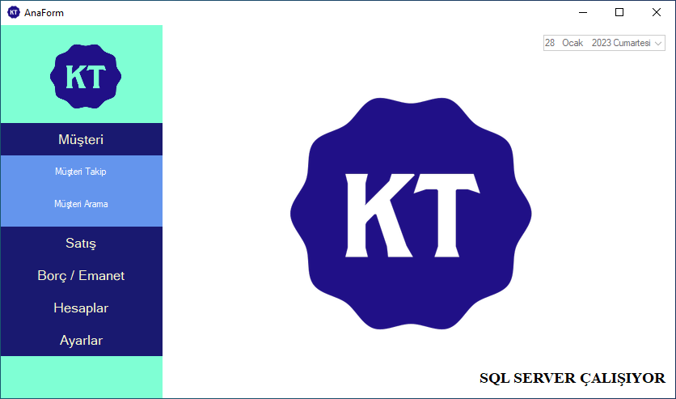
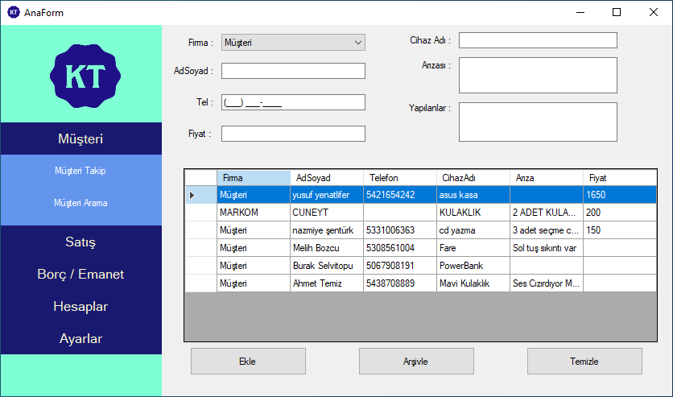
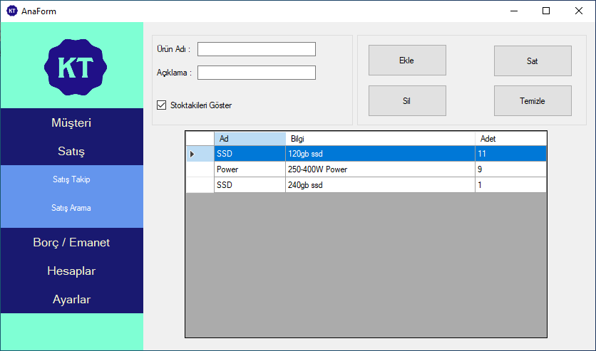
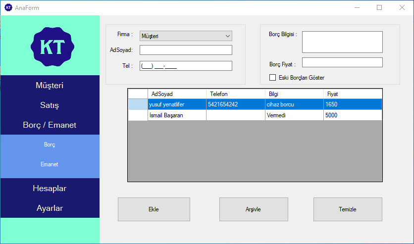

# KT_Musteri Takip SİSTEMİ
Kılıç Teknik için yaptığım Müşteri Takip Sistemi
Program C# ve SQL dilleri kullanmaktadır.
Müşteri Arama ve Bilgi girme, Satış Takibi ve Arama sistemi ve Borç / Emanet Sistemi vardır.
Bilgiler SQLServer'da tutulup yedekleme ve değiştirme yapılabiliyor.

  
  
  
  

